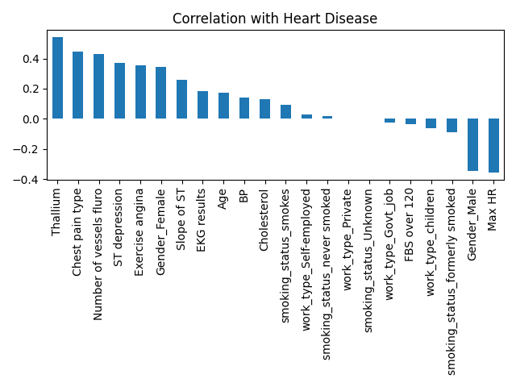
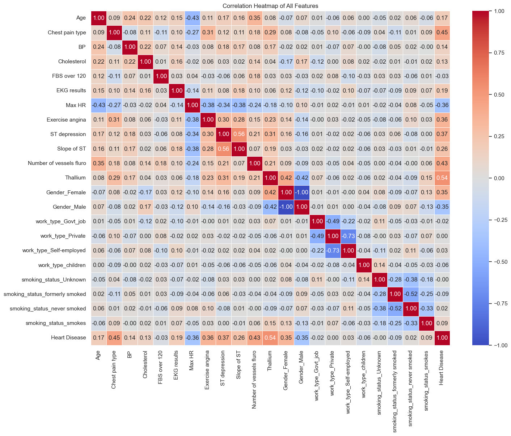
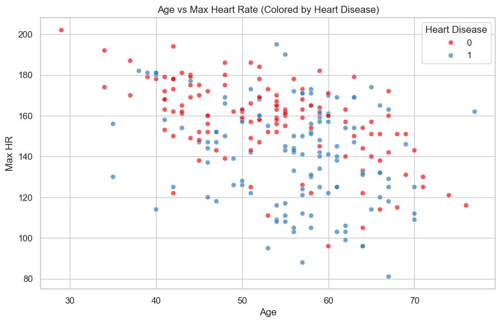
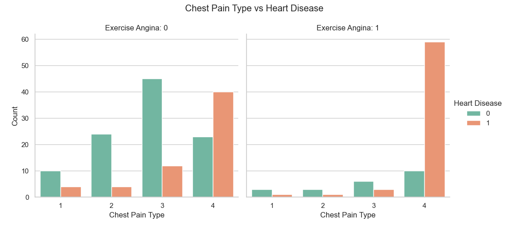
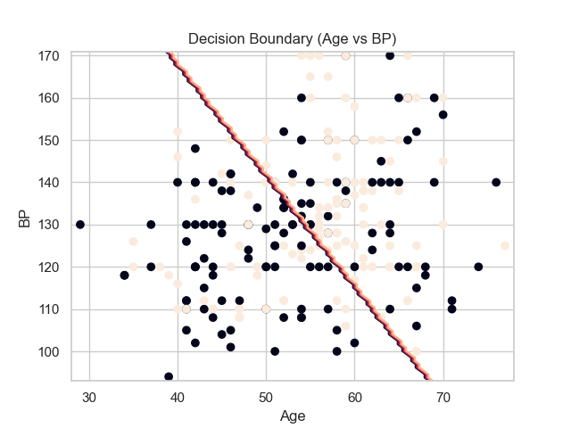
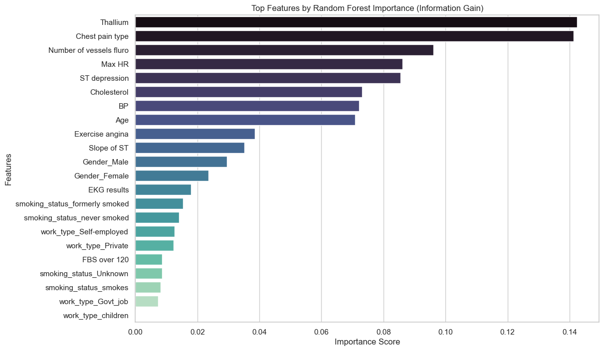

# Heart Disease Prediction Project Report

## 1. Preprocessing & Analysis
Before delving into building the models, the dataset was cleaned and analyzed through consecutive feature engineering and exploratory phases.

### 1.1 Data Preprocessing
Before feeding the data into the machine learning models, the following advanced preprocessing steps were applied to the dataset to ensure high data quality:
- **Missing Value Imputation:** Used `SimpleImputer` to fill missing values (`median` strategy for numerical columns, `most_frequent` strategy for categorical columns).
- **Outlier Handling:** Applied the Interquartile Range (IQR) method to clip outliers in key numerical features (`Age`, `BP`, `Cholesterol`, `Max HR`, `ST depression`), preventing extreme values from skewing the models.
- **Categorical Encoding:** Leveraged `OneHotEncoder` for nominal categorical features (`Gender`, `work_type`, `smoking_status`) and ensured ordinal columns were properly preserved as integers. The target variable was encoded using `LabelEncoder`.
- **Handling Class Imbalance:** Applied **SMOTENC** (Synthetic Minority Over-sampling Technique for Nominal and Continuous) to synthetically balance the training dataset, significantly improving the models' ability to detect the minority class.
- **Feature Selection:** Built heavily upon the EDA phase. The 9 low-correlation, high-noise columns mentioned above were confidently dropped from the dataset to improve model generalization.
- **Target Variable:** The target classification variable is `Heart Disease` (1 for Positive/Risk, 0 for Negative/Healthy).
- **Feature Scaling:** `StandardScaler` was used to standardize the numerical features (`Age`, `BP`, `Cholesterol`, `Max HR`, `ST depression`) so they have a mean of 0 and a standard deviation of 1. This step is strictly required for distance-based models (like KNN and SVM) and gradient-based models (like MLP and Logistic Regression).

### 1.2 Exploratory Data Analysis (EDA) & Feature Selection
An extensive data analysis phase (`analysis/Analysis.py` and `Phase1_EDA.ipynb`) was conducted to uncover underlying patterns, understand feature distributions, and select the most impactful variables for the models.

#### Key Insights from Analysis
- **Correlation Analysis:** A correlation matrix highlighted that variables such as `Chest pain type`, `Max HR`, `Exercise angina`, `Age`, and `ST depression` are the strongest predictors of Heart Disease. 

- **Continuous Trends:** Scatter plots (like *Age vs Max HR*) demonstrated clear clusters, showing that elevated age tied with specific heart rate reductions often correlated with disease onset.

- **Categorical Trends & Decision Boundaries:** The bar charts grouping *Chest Pain Type vs Heart Disease* (split by *Exercise Angina*) revealed significant risk disparities across pain type categories. 2D mapping (e.g., *Age vs BP*) using preliminary models (like Logistic Regression) helped visualize the linear separability of the disease vs. healthy classes.

- **Feature Importance:** Random forest highlighted the hierarchy of feature dependencies to predict heart diseases accurately.

#### Discarded Columns
To minimize noise and prevent the "curse of dimensionality", the following 9 columns were discarded before training:
`Gender_Female`, `work_type_Govt_job`, `work_type_Private`, `work_type_Self-employed`, `work_type_children`, `smoking_status_Unknown`, `smoking_status_formerly smoked`, `smoking_status_never smoked`, `smoking_status_smokes`.
**Reason for removal:** These features (primarily related to work type and smoking status granularity extracted from one-hot encoding) exhibited near-zero correlation with the target variable. Keeping them would only hinder distance-based models (like KNN) and decision trees without providing predictive value.

*(Note: Data analysis charts are located in the `analysis` directory or can be generated by running `analysis/Analysis.py`).*

---

## 2. Classification Models & Optimal Hyperparameters
After extensive hyperparameter tuning using `GridSearchCV`, the best configurations for each model were determined to maximize test accuracy.

#### 1. Logistic Regression
- **Hyperparameters Tested:**
  - `C` (Inverse of regularization strength): `[0.01, 0.1, 1, 10, 100]`
  - `penalty` (Regularization type): `['l1', 'l2']`
- **Best Configuration Selected:** 
  - `C`: 0.01, `penalty`: 'l2'

#### 2. Decision Tree
- **Hyperparameters Tested:**
  - `max_depth` (Maximum depth of the tree): `[3, 4, 5, 6]`
  - `min_samples_split` (Minimum samples required to split an internal node): `[15, 20, 30]`
  - `criterion` (Function to measure split quality): `['gini', 'entropy']`
- **Best Configuration Selected:**
  - `criterion`: 'entropy', `max_depth`: 5, `min_samples_split`: 15

#### 3. Random Forest
- **Hyperparameters Tested:**
  - `n_estimators` (Number of trees): `[100, 300, 500]`
  - `max_depth` (Maximum depth of trees): `[3, 4, 5]`
  - `min_samples_split`: `[5, 10, 15]`
  - `min_samples_leaf`: `[2, 4]`
  - `max_features`: `['sqrt', 'log2']`
  - `criterion`: `['gini', 'entropy']`
- **Best Configuration Selected:** 
  - `n_estimators`: 100, `max_depth`: 5, `min_samples_split`: 10, `min_samples_leaf`: 2, `max_features`: 'sqrt', `criterion`: 'gini'

#### 4. Support Vector Machine (SVM)
- **Hyperparameters Tested:**
  - `C` (Regularization parameter): `[0.1, 1, 10, 100]`
  - `kernel` (Kernel type): `['linear', 'rbf']`
- **Best Configuration Selected:**
  - `C`: 1, `kernel`: 'rbf'

#### 5. K-Nearest Neighbors (KNN)
- **Hyperparameters Tested:**
  - `n_neighbors` (Number of neighbors): `[1, 3, 5]`
  - `metric` (Distance metric): `['euclidean', 'manhattan']`
- **Best Configuration Selected:**
  - `metric`: 'manhattan', `n_neighbors`: 3

#### 6. Multi-Layer Perceptron (Neural Network)
- **Hyperparameters Tested:**
  - `hidden_layer_sizes` (Neurons and layers): `[(16,), (32, 16), (64, 32, 16)]`
  - `activation` (Activation function): `['relu', 'tanh']`
  - `alpha` (L2 penalty/regularization): `[0.001, 0.01, 0.1]`
  - `learning_rate_init` (Initial learning rate): `[0.001, 0.01]`
- **Best Configuration Selected:**
  - `activation`: 'tanh', `alpha`: 0.001, `hidden_layer_sizes`: (64, 32, 16), `learning_rate_init`: 0.01

#### 7. XGBoost
- **Hyperparameters Tested:**
  - `learning_rate` (Step size shrinkage): `[0.01, 0.05]`
  - `n_estimators` (Number of boosting rounds): `[100, 150]`
  - `max_depth` (Maximum tree depth): `[3, 4]`
  - `subsample` (Subsample ratio of the training instances): `[0.7, 0.8]`
  - `colsample_bytree` (Subsample ratio of columns): `[0.7, 0.8]`
- **Best Configuration Selected:**
  - `learning_rate`: 0.05, `n_estimators`: 100, `max_depth`: 3, `subsample`: 0.8, `colsample_bytree`: 0.7

---

## 3. Application Architecture (Streamlit GUI)
To deliver precise patient diagnostics, the 6 configured models were integrated into a Streamlit GUI (`app.py`).

**Prediction Strategy: Ensemble Majority Vote**
- The live input data is processed on the fly (numerical columns are scaled using the fitted `StandardScaler`).
- Tree-based models (Random Forest, Decision Tree, XGBoost) use the raw original features.
- The rest (KNN, MLP, Logistic Regression, SVM) use the scaled features.
- Each model outputs a vote: *Healthy (0)* or *Risk (1)*.
- The final diagnosis predicts a **High Risk** of Heart Disease if 4 or more out of the 7 models vote *Positive*. Otherwise, the patient is flagged as **Low Risk**.
## 4. Model Evaluation Metrics on Test Set
| Model | Accuracy | Precision | Recall | F1 Score |
|---|---|---|---|---|
| Random Forest | 89.29% | 90.91% | 83.33% | 86.96% |
| XGBoost | 87.50% | 90.48% | 79.17% | 84.44% |
| KNN | 83.93% | 77.78% | 87.50% | 82.35% |
| Support Vector Machine | 83.93% | 80.00% | 83.33% | 81.63% |
| Logistic Regression | 83.93% | 82.61% | 79.17% | 80.85% |
| MLP | 83.93% | 82.61% | 79.17% | 80.85% |
| Decision Tree | 82.14% | 79.17% | 79.17% | 79.17% |
